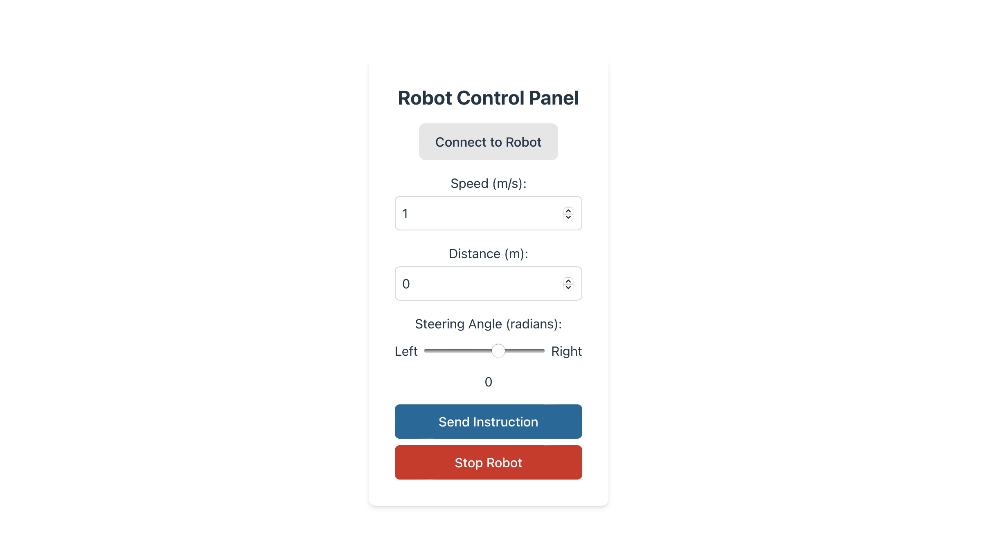
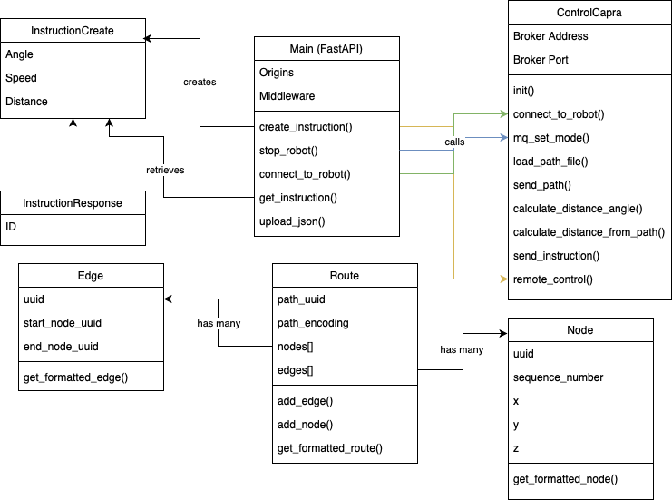

# capra-interface

This application can be used to control a Capra Hircus robot using Python.
The application consists of three layers:

- A Vue/Vite front-end
- A Python FastAPI back-end (For more information see: [Back-end API Documentation](docs/API.md))
- A Class containing methods for interfacing with a Capra Hircus robot (For more information see: [CapraControl Documentation](docs/controller.md)).
- Various Models for describing different types of data (For more information see: [Models Documentation](docs/models.md))

Shown below is a screenshot of the application taken May 13th 2024:


Shown below is a class diagram describing the structure of this project as of May 13th 2024:
  
This image will be updated as the project progresses.

## Requirements

This project has the following requirements:

- Python3
- Pip3
- NPM
- A Capra Hircus robot

## Dependencies

This project has the following dependencies:

- fastapi
- geopy
- paho_mqtt
- pydantic
- pytest
- SQLAlchemy
- uvicorn

## Connecting to the robot's wifi

To be able to control a Capra Hircus robot using this application, it is necessary to connect to the WiFi network that is generated by the robot.
Default credentials are:

- Network: HIRCUS-0027
- Password: CapraDefaultKey

**The application is only usable when connected to the WiFi network of the robot.**

After connecting with the WiFi you can click the _'Connect to Robot'_ button in the application

## Using capra-interface to control a Capra Hircus robot.

After completing the installation steps as described below and connecting to the robot's network, you can use the application to send driving instructions to control the robot.

- _Connect to Robot_ will establish a connection with the robot to be able to control it.
- _Speed_ allows the user to set the driving speed in meters per second with a limit of 2 m/s.
- _Distance_ allows the user to set the driving distance in meters.
- _Steering angle_ allows the user to steer te robot where _1.5_ is the maximum leftward angle and _-0.8_ is the maximum rightward angle.

## Installation - Back-end

To install the Python FastAPI back-end, run the following commands:

Install dependencies

```bash
pip3 install -r requirements.txt
```

Start API server

```bash
uvicorn main:app
```

## Installation - Docker Image

The FastAPI back-end can also be used as a docker image. To build a docker image for the API, use the following command:

```bash
docker build -t capra-api .
```

After the build is completed, the image can be used using the following command:

```bash
docker run -d  -p 8000:8000 capra-api
```

To enable the output of the container, simply remove the `-d` flag from the command.

## Installation - Front-end

To install the Vue/Vite front-end, run the following commands:

Build front-end

```bash
cd capra-frontend
```

```
npm install
```

Build TailwindCSS

```
npx tailwindcss init -p
```

Start front-end server

```
npm run dev
```

Alternatively it is possible to expose the front-end to the local network by using the following command:

```bash
npm run dev -- --host
```

## Capra Hircus path file

This application makes use of `.json` files structured as specified in the Capra Hircus official documentation. This files can be found in the `./data` folder.
Below is an example of a path file as specified by documentation:

```json
{
  "timestamp": "2024-04-2 12:56:51",
  "path_uuid": "Path2",
  "map_uuid": "",
  "position_encoding": 0,
  "nodes": [
    {
      "uuid": "Node_0",
      "sequence_number": 0,
      "position": {
        "x": 54.040360393900656,
        "y": 6.567137289287426,
        "z": 54.61400798801333
      },
      "actions": [],
      "isIndoor": false
    },
    {
      "uuid": "Node_1",
      "sequence_number": 1,
      "position": { "x": 54.04027615536029, "y": 6.567062540014308, "z": 0.0 },
      "actions": [],
      "isIndoor": false
    }
  ],
  "edges": [
    {
      "uuid": "Edge_0",
      "start_node_uuid": "Node_0",
      "end_node_uuid": "Node_1",
      "actions": [
        {
          "name": "Set speed",
          "uuid": "drive",
          "parameters": [
            {
              "key": "speed",
              "type": 2,
              "value_float32": 0.4,
              "value_float64": 0.4
            }
          ]
        }
      ]
    }
  ],
  "is_indoor": false
}
```
